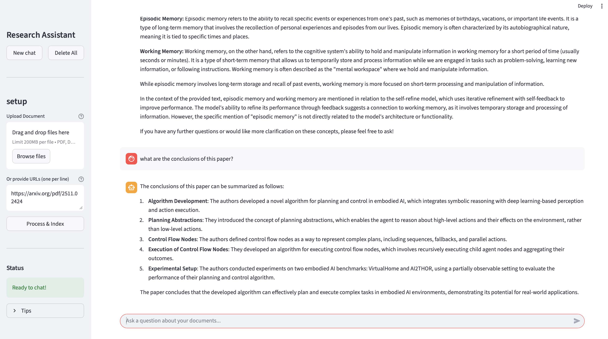

# LLM-Powered-Research-Assistant

A production-grade backend system that answers research questions using a combination of Retrieval-Augmented Generation (RAG), vector similarity search (Qdrant), and a HuggingFace transformer-based question answering model. Feedback from users can be collected and used to fine-tune the model via Direct Preference Optimization (DPO).

---
## Features
- For inferencing I am using Ollama with a quantized Llama3 model
- Semantic search over research papers using embeddings + Qdrant
- LLM-based answer generation with grounding
- User feedback collection for training preference pairs
- FastAPI backend with modular architecture
<!-- - Supports DPO fine-tuning pipeline (HuggingFace TRL) -->
<!-- - 📦 Containerized with Docker for deployment -->
---
## Current Challenges:
- Context generated is still not optimal
- Need to improve how data is stored in indexed

## 📌 Project Navigation
This project is being built in public. Alongside the codebase, I maintain open documentation of design decisions, ongoing challenges, and planned improvements.

**Explore the project:**

- **🗺 Roadmap** — Planned features and development direction  
  → [`ROADMAP.md`](ROADMAP.md)

- **📖 Engineering Journal** — Challenges faced and how they were solved  
  → [`/challenges`](./challenges)

<!-- - **🏗 Architecture & Design Docs** — System design and technical decisions  
  → [`/docs`](./docs) -->

<!-- - **📝 Changelog** — Notable progress and version history  
  → [`CHANGELOG.md`](CHANGELOG.md) -->

<!-- - **🐛 Open Problems & Discussions**  
  → [GitHub Issues](../../issues) -->

---
## Working demo 


## 📁 Project Structure
```bash
LLM-Powered-Research-Assistant/
├── app/
│   ├── main.py                # FastAPI entrypoint
│   ├── api/                   # API layer
│   │   ├── routes.py          # API endpoints
│   │   └── dependencies.py    # Input validation and dependency injection
│   ├── core/                  # Business logic
│   │   ├── inference.py       # QA pipeline
│   │   ├── retriever.py       # FAISS retrieval logic
│   │   ├── feedback.py        # Feedback persistence logic
│   │   └── utils.py           # Utility functions
├── data/                     # Raw arXiv papers
├── models/                   # Saved DPO fine-tuned models
├── scripts/                  # Ingestion + fine-tuning scripts
│   ├── ingest3.py             # Chunking + embedding logic
│   └── train_dpo.py          # DPO fine-tuning workflow
├── Dockerfile
├── requirements.txt
└── README.md
```

---

## 🛠️ Setup Instructions

### 1. Clone the repository
```bash
git clone https://github.com/yourusername/LLM-Powered-Research-Assistant.git
cd LLM-Powered-Research-Assistant
```

### 2. Install dependencies
```bash
python -m venv venv
source venv/bin/activate  # or venv\Scripts\activate on Windows
pip install -r requirements.txt
```
### Run Qdrant locally (docker)
```bash
docker run -p 6333:6333 qdrant/qdrant 
```   
### 3. Run the FastAPI app (in new shell)
```bash
uvicorn app.main:app --reload
```
Access the API at: http://localhost:8000/api/ask

### 4. Run the streamlit app 
streamlit run frontend/app2.py
---

## 📬 API Endpoints

- `POST /api/ask`
```json
{
  "query": "What is DPO in LLM training?"
}
```
- `POST /api/feedback`
```json
{
  "query": "What is DPO?",
  "response": "Direct Preference Optimization...",
  "user_feedback": "positive"
}
```

---

## Model & Tools
- LLM: distilbert-base-cased-distilled-squad (default, replaceable)
- Embedding: sentence-transformers (e.g. all-MiniLM-L6-v2)
- VectorDB: Qdrant
- Fine-tuning: HuggingFace TRL (DPO)

---

## Docker Usage

You can run this project in a Docker container for easy deployment and reproducibility.

### Build the Docker Image

```sh
docker build -t llm-research-assistant .
```

### Run the Docker Container

```sh
docker run -p 8000:8000 llm-research-assistant
```

This will start the FastAPI server and expose it on [http://localhost:8000](http://localhost:8000).

### Environment Variables
If you need to set environment variables (such as `HF_TOKEN` for Hugging Face), you can pass them with the `-e` flag:

```sh
docker run -p 8000:8000 -e HF_TOKEN=your_hf_token llm-research-assistant
```

Or use a `.env` file:

```sh
docker run --env-file .env -p 8000:8000 llm-research-assistant
```

### Notes
- Make sure your `requirements.txt` is up to date with all dependencies.
- The Dockerfile installs system dependencies needed for PDF extraction (e.g., `poppler-utils`).
- If you want to mount local data or models, use the `-v` flag with `docker run`.

---

## Future Enhancements

- [ ] Integrate LangChain agents
- [ ] Add logging and monitoring (Prometheus)
- [ ] Deploy to cloud (AWS/GCP/Render)

---

<!-- ## Author
Vikas Kumar -->